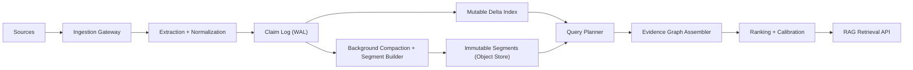

# DASH (Evidence Memory Engine)

Version: v0.1 draft  
Date: 2026-02-17  
Status: Architecture proposal

## 1. Executive Summary

DASH is a retrieval system designed for RAG where the primary data primitive is an **atomic claim with provenance**, not a standalone embedding vector.  
Vectors remain important, but as secondary access paths. The core value is evidence quality: support, contradiction, temporal validity, and citation integrity.

### Why this exists

Current vector-first systems optimize nearest-neighbor recall but underperform on:

- contradiction-aware retrieval
- temporal correctness
- citation-grade answer traceability
- multi-hop evidence assembly

DASH addresses these by storing a verifiable evidence graph and running query-time evidence computation.

### Product thesis

If retrieval returns the most reliable evidence subgraph instead of nearest text chunks, downstream generation quality and trust increase materially for enterprise and high-stakes workflows.

## 2. Design Goals and Non-Goals

### 2.1 Goals

- Evidence-first retrieval for RAG with explicit support and contradiction handling
- Low-latency serving on fresh data (near real-time ingestion to query visibility)
- Horizontal scale to billion-claim corpora
- Strong provenance guarantees for each answerable unit
- Extensible scoring across semantic, lexical, structural, and temporal signals

### 2.2 Non-goals (v1)

- full general graph database replacement
- arbitrary OLAP analytics engine
- end-user document authoring platform

## 3. Core Concepts

- **Claim**: atomic, normalized statement extracted from one or more source spans.
- **Evidence**: source-bound observation supporting or contradicting a claim.
- **Edge**: typed relation between claims (`supports`, `contradicts`, `refines`, `duplicates`, `depends_on`).
- **Entity**: canonical node for persons, orgs, products, places, etc.
- **Temporal scope**: `event_time` and validity interval for claim relevance.
- **Confidence**: calibrated probability-like score tied to extraction/model/source quality.

## 4. System Requirements

### 4.1 Functional

- ingest raw content (docs, web, tickets, transcripts, tables)
- extract and normalize claims + provenance spans
- de-duplicate and resolve claim identities
- build support/contradiction links
- retrieve top evidence subgraph for a query
- return machine-readable citations for every retrieved claim

### 4.2 Non-functional

- p95 query latency <= 350 ms for top-50 candidate graph assembly
- ingestion freshness <= 5 seconds for hot path visibility
- availability >= 99.95% for read API
- linear scale-out by shard count
- tenant isolation with strict authz boundaries

## 5. High-Level Architecture



## 6. Data Model

### 6.1 Claim record

```json
{
  "claim_id": "clm_01J...",
  "tenant_id": "tnt_...",
  "canonical_text": "Company X acquired Company Y",
  "claim_type": "acquisition",
  "entities": ["ent_company_x", "ent_company_y"],
  "event_time": "2025-09-03T00:00:00Z",
  "valid_from": "2025-09-03T00:00:00Z",
  "valid_to": null,
  "confidence": 0.82,
  "status": "active",
  "embedding_ids": ["emb_dense_v3_..."],
  "lexical_features": {"tokens": ["company", "acquired"]},
  "created_at": "2026-02-17T18:10:00Z",
  "updated_at": "2026-02-17T18:10:00Z"
}
```

### 6.2 Evidence record

```json
{
  "evidence_id": "evd_01J...",
  "claim_id": "clm_01J...",
  "source_id": "src_...",
  "doc_id": "doc_...",
  "chunk_id": "chk_...",
  "span_start": 1024,
  "span_end": 1168,
  "stance": "supports",
  "extraction_model": "extractor_v5",
  "source_quality": 0.91,
  "ingested_at": "2026-02-17T18:10:01Z"
}
```

### 6.3 Claim edge

```json
{
  "edge_id": "edg_01J...",
  "from_claim_id": "clm_01J_A",
  "to_claim_id": "clm_01J_B",
  "relation": "contradicts",
  "strength": 0.73,
  "reason_codes": ["numeric_conflict", "time_overlap"],
  "created_at": "2026-02-17T18:11:10Z"
}
```

## 7. Storage Engine and Indexes

### 7.1 Storage layers

- **WAL / claim log**: append-only durability and replay.
- **Delta store**: mutable LSM-like structures for fresh writes.
- **Segment store**: immutable compacted claim/evidence segments on object storage.
- **Metadata store**: schema versions, tenant configs, snapshots, and routing tables.

### 7.2 Index families

- dense vector ANN index (candidate generation)
- sparse lexical index (BM25 or learned sparse)
- entity index (entity -> claims)
- temporal index (event time windows)
- edge index (claim -> neighboring claims by relation type)
- provenance index (claim/evidence -> source spans)

### 7.3 Tiering

- hot: in-memory delta + frequently accessed segment pages
- warm: local NVMe segment cache
- cold: object storage

## 8. Ingestion and Freshness Pipeline

### 8.1 Write path

1. receive source payload at ingestion gateway
2. chunk and normalize source
3. extract candidate claims with provenance spans
4. entity-link and canonicalize claims
5. assign confidence priors
6. append claims/evidence/edges to WAL
7. index into mutable delta indexes
8. ack when WAL + delta write succeeds

### 8.2 Background jobs

- merge duplicate claims and evidence clusters
- compact delta into immutable segments
- rebuild ANN centroids / graph layers incrementally
- recalibrate confidence using delayed quality feedback

### 8.3 Freshness guarantees

- default visibility: sub-5 seconds
- strict mode: synchronous publish barrier for regulated workloads

## 9. Query and Retrieval Pipeline

### 9.1 Query decomposition

Parse user query into:

- intent / question type
- entity constraints
- temporal filters
- stance requirement (support-only, contradiction-aware, balanced)

### 9.2 Candidate generation

- dense ANN top-N
- sparse lexical top-M
- entity and metadata constrained fetch
- union and dedupe

### 9.3 Graph assembly

- expand one or two hops on support/contradiction edges
- enforce temporal consistency windows
- prune low-provenance branches

### 9.4 Ranking

Composite score example:

```text
score =
  w_sem * semantic_similarity +
  w_lex * lexical_match +
  w_sup * support_strength -
  w_con * contradiction_risk +
  w_tmp * temporal_relevance +
  w_src * source_quality +
  w_cal * calibration_confidence
```

Weights are tenant-tunable and model-versioned.

### 9.5 Output contract

Return:

- ranked claims
- evidence spans and source citations
- support/contradiction summary per claim
- confidence bands
- optional graph neighborhood (for agentic reasoning)

## 10. Consistency and Distributed Systems Design

### 10.1 Partitioning

Primary shard key:

- `tenant_id` + `entity_hash` (default)

Alternative modes:

- time-bucket partitioning for stream-heavy workloads
- claim-type partitioning for vertical domains

### 10.2 Replication

- 3 replicas per shard (leader + followers)
- quorum write for strict mode; leader-ack for low-latency mode

### 10.3 Consistency model

- read-after-write on same session token in strict mode
- eventual consistency cross-region by default

### 10.4 Rebalancing

- online shard split/merge
- segment streaming with checksum verification
- routing-table epoch switch for no-downtime migration

### 10.5 Failure handling

- WAL replay for node crash recovery
- follower promotion with bounded staleness checks
- degraded query mode if segment cache unavailable

## 11. APIs (v1)

### 11.1 Ingestion APIs

- `POST /v1/sources`
- `POST /v1/claims:upsert`
- `POST /v1/evidence:upsert`

### 11.2 Retrieval APIs

- `POST /v1/retrieve` (ranked evidence claims for RAG)
- `POST /v1/retrieve:graph` (returns compact evidence subgraph)
- `GET /v1/claims/{id}`

### 11.3 Ops APIs

- `GET /v1/health`
- `GET /v1/indexes/status`
- `POST /v1/admin/reindex`

### 11.4 Example retrieve request

```json
{
  "tenant_id": "tnt_123",
  "query": "Did Company X acquire Company Y in 2025?",
  "top_k": 20,
  "time_range": {"from": "2025-01-01", "to": "2025-12-31"},
  "stance_mode": "balanced",
  "return_graph": true
}
```

## 12. Security, Governance, and Multi-Tenancy

- per-tenant encryption keys for at-rest data
- row-level tenant isolation in all indexes and caches
- scoped API keys and OIDC integration
- immutable audit trail for claim and evidence changes
- PII tagging and redaction policies at ingest
- retention policies by source class and compliance profile

## 13. Observability and SRE

### 13.1 Golden metrics

- query p50/p95/p99 latency
- recall-at-k on labeled validation sets
- citation coverage rate (answers with at least one valid citation)
- contradiction miss rate
- freshness lag (ingest to query-visible)
- shard imbalance factor

### 13.2 Tracing

Trace spans for:

- query parse
- candidate generation by index type
- graph expansion
- ranking
- response serialization

### 13.3 Alerting

- freshness lag breach
- recall regression by model/index version
- replica divergence beyond threshold

## 14. Evaluation Framework

### 14.1 Benchmark dimensions

- retrieval quality (nDCG, Recall@k, MRR)
- evidence quality (provenance precision, contradiction detection F1)
- temporal accuracy (time-constrained answer correctness)
- system performance (latency, throughput, cost/query)

### 14.2 Dataset strategy

- public corpora for baseline comparability
- domain-specific internal corpora for production validity
- adversarial sets with contradictory and stale facts

### 14.3 Evaluation protocol

1. index dataset with fixed compute budget
2. run query suite with fixed latency SLO constraints
3. compare quality vs cost under equal constraints
4. run ablations for each signal family (semantic, lexical, graph, temporal)

## 15. Build Plan and Milestones

### Phase 0 (2 to 4 weeks): skeleton

- ingestion gateway
- WAL + delta store
- minimal claim/evidence schema
- basic retrieve endpoint

Exit criteria:

- stable ingestion and retrieval on 10M claims

### Phase 1 (4 to 8 weeks): evidence graph core

- support/contradiction edge builder
- graph-aware ranking
- provenance API guarantees

Exit criteria:

- measurable lift over dense-only baseline in contradiction-heavy tasks

### Phase 2 (6 to 10 weeks): distributed scaling

- shard routing service
- replication and failover
- segment compaction + object storage

Exit criteria:

- 1B claim scale test with target SLOs

### Phase 3 (4 to 6 weeks): hardening

- multi-tenant security controls
- observability + runbooks
- automated benchmarking pipeline

Exit criteria:

- production readiness checklist complete

## 16. Cost and Capacity Model (Initial)

### Capacity assumptions

- 1B claims
- avg 2.5 evidence records per claim
- 768-dim dense embeddings
- 90-day hot window

### Cost levers

- vector precision/compression settings
- segment compaction frequency
- warm cache hit rate
- replication factor per tenant tier

### Optimization order

1. improve cache locality and query planner pruning
2. compress cold embeddings and old segments
3. offload long-tail graph expansion to async mode

## 17. Risks and Mitigations

- extraction quality drift  
  Mitigation: model-version pinning, continuous calibration, shadow evaluations.

- graph explosion on noisy data  
  Mitigation: edge confidence thresholds, degree caps, periodic pruning.

- latency regression at scale  
  Mitigation: bounded expansion depth, index tiering, adaptive top-k.

- tenant data leakage risk  
  Mitigation: strict tenant predicates at index and cache layers, audit tests.

## 18. Open Questions

- Should contradiction edges be generated fully online or partially batch?
- What is the minimum evidence count per claim to expose in high-trust mode?
- Which calibration strategy performs best by domain (temperature scaling vs isotonic)?
- Should vector and sparse ranking be fused early or late for target workloads?

## 19. Success Criteria

DASH is successful when:

- retrieval outputs are citation-complete and contradiction-aware by default
- quality lifts over vector-only baseline are consistent under equal latency budgets
- freshness and SLO targets hold at production scale
- downstream RAG hallucination rate drops materially in evaluated tasks

## 20. Implementation Notes for This Repository

Recommended initial repo structure:

```text
/docs
  /architecture
    eme-architecture.md
  /benchmarks
    evaluation-protocol.md
/services
  /ingestion
  /retrieval
  /indexer
/pkg
  /schema
  /ranking
  /graph
```

If you keep this as a single-file proposal first, this document can be split into:

- product-and-scope.md
- data-model.md
- distributed-systems.md
- retrieval-and-ranking.md
- benchmark-and-rollout.md

Current implementation notes (2026-02-18):

- `pkg/store` now supports snapshot checkpoints at `<wal_path>.snapshot`.
- Recovery path replays `snapshot + WAL delta` instead of full WAL history.
- Compaction API (`checkpoint_and_compact`) writes a snapshot and truncates WAL for faster restart.
- Ingest path can apply configurable automatic checkpoint thresholds (WAL record count and/or WAL bytes).
- Ingestion WAL path now supports bounded append buffering + sync scheduling hooks (`sync_every_records`, append-buffer threshold, optional sync interval) with strict defaults preserved for crash safety.
- `services/retrieval` includes a dependency-light HTTP transport (`GET /health`, `GET /v1/retrieve?...`, `POST /v1/retrieve` JSON) layered directly on retrieval API contracts.
- Retrieval now enforces request `time_range` semantics on claim `event_time_unix` and rejects invalid ranges where `from_unix > to_unix`.
- WAL checkpoint policy checks use cached record counts in-memory (avoids O(N) WAL scans on each ingest decision).
- Ingestion and retrieval binaries support startup replay from persisted WAL with replay breakdown logging (snapshot records vs WAL delta records).
- Ingestion and retrieval transports default to dependency-light `std` HTTP runtime and now support optional `axum` runtime selection via `DASH_*_TRANSPORT_RUNTIME` (`EME_*` fallback) when built with feature `async-transport`.
- Ingestion/retrieval transports now support tenant-scoped authz policy controls:
  - service-level tenant allowlists (`DASH_*_ALLOWED_TENANTS`)
  - per-API-key tenant scopes (`DASH_*_API_KEY_SCOPES`)
- Ingestion/retrieval transports now support optional JSONL audit event sinks (`DASH_*_AUDIT_LOG_PATH`) and publish auth/audit counters on `/metrics`.
- `services/indexer` now includes immutable segment lifecycle primitives:
  - atomic segment writer + manifest writer
  - manifest/segment reader with checksum integrity verification
  - compaction scheduler planning hook and compaction-plan application helper
- ingestion runtime can publish tenant-scoped immutable segment snapshots to disk (`DASH_INGEST_SEGMENT_DIR`).
- retrieval API can apply segment-backed claim prefiltering (`DASH_RETRIEVAL_SEGMENT_DIR`) as a bounded read-path prototype.
- retrieval read source-of-truth is now explicit: `immutable segment base + mutable WAL delta`, then optional metadata prefilter intersection.
- ingestion and retrieval transports expose placement-debug snapshots via `GET /debug/placement` (per-shard replicas, epoch, role, health, and optional route probe context).

## 21. Implementation Reality Check (What we have discussed)

### 21.1 What is built now

- schema + validation path is in place and working
- WAL durability, replay, checkpoint snapshot, and compaction flow are implemented
- indexed retrieval path exists (inverted/entity/temporal indexes)
- dense vector payload ingestion + tenant dimension enforcement are implemented
- ANN candidate generation now uses a leveled graph backend with entry-point descent + bounded best-first expansion
- metadata-filter retrieval now uses indexed prefilter planning (entity + embedding-id) before final scoring
- ranking includes BM25 + blended scoring
- graph traversal supports multi-hop expansion
- retrieval API integrates graph and citation-bearing outputs
- ingestion/retrieval transports are functional (std runtime default; optional axum feature path)
- tenant-scoped authz and audit hooks are implemented in ingestion/retrieval transport
- indexer immutable segment prototype is implemented (writer/reader/checksum + scheduler hooks), and ingestion/retrieval now have basic segment publish/read wiring
- indexer and metadata-router evolved beyond scaffold; placement-aware routing is now enforced in ingestion/retrieval request admission paths
- benchmark tooling now reports baseline scan vs candidate-reduction metrics
- benchmark profile matrix includes smoke/standard/large plus a hybrid metadata+embedding profile
- full workspace tests are green (`cargo test --workspace`)

### 21.2 Biggest remaining gaps to true full vector DB

- ANN recall/latency tuning toward production-grade HNSW-style behavior
- metadata-filter planning over larger ANN candidate pools (to avoid filter drop-off on strict constraints)
- full segment runtime integration (delta->segment promotion in live serving path + object-store tier)
- distributed shard ownership + failover orchestration runtime (routing primitives are wired, but epoch-health observability and failover automation are still pending)
- full authn federation (OIDC/JWT), hard tenant isolation audits, encryption controls
- production observability + formal SLO enforcement loops

### 21.3 Practical completion estimate

- ~60–70% complete for single-node evidence retrieval engine
- ~30–40% complete for full vector-database end-state

### 21.4 Next execution order

1. tune leveled ANN backend (neighbor budgets, search budget, recall guardrails)
2. add richer hybrid planner controls (ANN + sparse + graph + metadata filters)
3. integrate segment writer/reader into serving pipeline + compaction service
4. add placement epoch/health observability + failover simulation across ingestion/retrieval services
5. harden auth policy (OIDC/JWT + key rotation + stricter tenant-isolation tests)

## 22. Immediate Build Batch (Post-ANN Hardening)

To continue execution without scope drift, implement this batch first:

1. tune leveled ANN path for stricter recall under large cardinalities
2. raise metadata-filter retrieval efficiency (without tenant-wide scan work)
3. wire segment lifecycle prototype into retrieval/runtime promotion loop
4. add tenant-scoped authz + audit hooks in transport layer
5. keep benchmark delta reporting across smoke/standard/large/hybrid profiles

Batch done when:

- ANN + metadata hybrid retrieval is stable and benchmarked at production fixture sizes
- fallback behavior works when vector index is unavailable
- replay, correctness, and benchmark gates stay green in CI
