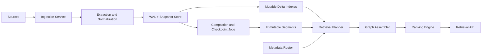

# DASH Full Architecture and Goals

Date: 2026-02-17
Status: active execution spec
Owner: DASH core engineering

## 1. Purpose

This document is the single working reference for building DASH as a production-grade Evidence Memory Engine for RAG.

It defines:

- what DASH is
- what is already built
- what remains
- exact architecture boundaries
- measurable goals and release gates
- phased implementation plan

## 2. Product Definition

DASH is an evidence-first retrieval engine.

The primary primitive is not a vector.
The primary primitive is a claim with evidence, provenance, contradiction context, and temporal validity.

### 2.1 Core principles (non-negotiable)

- `Claim`, `Evidence`, `ClaimEdge` are first-class storage and retrieval units.
- Vectors are one ranking signal, never the entire retrieval strategy.
- Retrieval must support both stances:
  - `balanced` (support + contradiction context)
  - `support_only` (strictly supporting evidence)
- Citation-grade output is mandatory for every returned claim.
- Storage durability path is WAL-first with replay, checkpoints, and compaction.
- Rust-first implementation for performance, reliability, and long-term systems control.

## 3. Full Goal Statement

### 3.1 North-star goal

Deliver a production-usable retrieval service that returns trustworthy, citation-backed evidence sets for RAG under realistic scale and latency constraints.

### 3.2 v1 goals (must hit)

- Correctness:
  - citation-bearing results for all retrieval responses
  - contradiction-aware and temporal-aware retrieval behavior
- Reliability:
  - crash-safe WAL durability and replay
  - checkpoint/snapshot recovery path validated in tests
- Performance:
  - p95 retrieval latency <= 350 ms on large benchmark profile
  - ingest-to-visible freshness <= 5s in single-region deployment path
- Operability:
  - health + metrics endpoints for ingestion and retrieval
  - deploy assets (systemd and container) and runbook
- Engineering quality:
  - CI green (fmt + clippy + tests + benchmark guards)
  - benchmark history artifacts and regression checks

### 3.3 v2 goals (scale path)

- Candidate generation beyond O(n) scan (ANN + sparse + metadata filters)
- Segment lifecycle (mutable delta -> immutable segment)
- tiered storage (memory + local disk + object store)
- shard routing and placement maturity

### 3.4 v3 goals (production hardening)

- authn/authz and strict tenant isolation checks
- audit trail and compliance posture
- incident readiness (rollback drills, SLO/error-budget process)

## 4. Current Build Analysis (as of 2026-02-17)

## 4.1 Implemented and working

- Rust workspace with core crates and services.
- Schema supports evidence-grade metadata:
  - claim: `entities`, `embedding_ids`
  - evidence: `chunk_id`, `span_start`, `span_end`
- Dense vector ingestion and retrieval plumbing:
  - ingestion accepts optional inline claim embedding payload (`claim.embedding_vector`)
  - retrieval accepts optional query embedding (`query_embedding`) for hybrid retrieval
  - ranking now fuses dense cosine signal with lexical/evidence features
- Store durability and recovery:
  - persistent `FileWal`
  - WAL replay
  - checkpoint + compaction snapshot flow
  - backward-compatible replay for legacy WAL records
  - claim-vector WAL/snapshot persistence and replay (`V` records)
- Ingestion service:
  - `POST /v1/ingest`
  - persistence mode with checkpoint policy
- Retrieval service:
  - `GET /v1/retrieve`, `POST /v1/retrieve`
  - structured citation payloads
  - structured metadata filters (`entity_filters`, `embedding_id_filters`)
  - optional graph payload
  - temporal filtering and stance modes
- Ops and deployment:
  - `/health` and `/metrics`
  - systemd + container assets
  - packaging scripts
- Benchmarking and quality gates:
  - smoke / standard / large profiles
  - history artifacts and regression guard
  - transport concurrency benchmark tooling
- indexed candidate generation and ranking improvements:
  - inverted index + temporal index + entity index in store
  - BM25 scoring integrated into ranking path
  - benchmark output now includes baseline scan count vs DASH candidate count

## 4.2 Partially implemented

- transport runtime migration:
  - default `std` HTTP runtime
  - optional `axum` path behind `async-transport` feature
  - runtime selection envs available (`DASH_*_TRANSPORT_RUNTIME`)
- security baseline:
  - optional API-key auth is available for ingestion and retrieval transports
  - supported headers: `X-API-Key` or `Authorization: Bearer <key>`
  - tenant allowlist policy and scoped API-key tenant policy are available (`DASH_*_ALLOWED_TENANTS`, `DASH_*_API_KEY_SCOPES`)
  - audit-event hooks are available (`DASH_*_AUDIT_LOG_PATH`) with auth/audit counters on `/metrics`
  - full federation (OIDC/JWT), key rotation, and hardened policy distribution remain pending
- ANN bootstrap layer:
  - in-store deterministic LSH bucket index for dense vectors is active
  - retrieval can use `query_embedding` with ANN-bucket candidate preselection
  - current implementation is a lightweight approximation, not yet HNSW/DiskANN class
- segment lifecycle prototype:
  - indexer now supports immutable segment persistence with atomic manifest + per-segment checksums
  - segment read path validates tier/count/checksum integrity on load
  - compaction scheduler hook (`plan_compaction_round`) and plan-application helper are implemented
  - ingestion runtime can publish tenant-scoped immutable segment snapshots via `DASH_INGEST_SEGMENT_DIR`
  - retrieval API can use segment snapshots as an additional claim allow-list prefilter via `DASH_RETRIEVAL_SEGMENT_DIR`
  - object-store tier and full live serving integration remain pending

## 4.3 Not yet implemented (critical)

- Production-grade ANN index for candidate generation at large scale (HNSW/DiskANN class).
- Sparse lexical index for hybrid retrieval quality.
- full segment runtime integration (delta->segment promotion in live pipeline) and object-store tier.
- distributed replication/failover and strict consistency modes.
- end-to-end security posture hardening (OIDC/JWT, key rotation, encryption controls, stricter tenant-isolation tests).

## 4.4 Reality-check summary (agreed)

- Current status:
  - ~60–70% of single-node evidence retrieval engine complete
  - ~30–40% of full vector database end-state complete
- Validation state:
  - workspace test suite passes (`cargo test --workspace`)
- Interpretation:
  - core evidence-first retrieval foundation is strong
  - primary risk to end-state is missing ANN + hybrid planning + segment lifecycle + distributed runtime/security hardening

## 5. Target Architecture (Production Shape)

## 5.1 Logical architecture

## 5.2 Service boundaries

- `services/ingestion`:
  - validates and ingests claim/evidence/edge payloads
  - writes durable records via WAL-backed store
- `services/retrieval`:
  - parses retrieval requests
  - executes stance/temporal-aware retrieval
  - returns machine-readable citations
- `pkg/store`:
  - core persistence, replay, compaction, in-memory query path
- `pkg/ranking`:
  - ranking signal composition (support/contradiction aware)
- `pkg/graph`:
  - graph summarization and edge-level reasoning hooks
- `services/indexer`:
  - target location for tier/index lifecycle logic
- `services/metadata-router`:
  - deterministic routing for future sharded deployment

## 5.3 Data contracts

- Claim:
  - identity: `claim_id`, `tenant_id`
  - content: `canonical_text`
  - quality/time: `confidence`, `event_time_unix`
  - metadata: `entities`, `embedding_ids`
- Evidence:
  - linkage: `evidence_id`, `claim_id`, `source_id`
  - stance/quality: `stance`, `source_quality`
  - provenance: `chunk_id`, `span_start`, `span_end`
- Retrieval output:
  - claim ranking fields
  - support/contradiction counts
  - structured citations with provenance metadata

## 5.4 Reliability model

- write durability: WAL append + fsync (`sync_data`) path
- replay path: snapshot + WAL delta reconstruction
- compaction: checkpoint-driven snapshot generation and WAL truncation
- startup observability: replay counters logged at service boot

## 5.5 Retrieval behavior model

1. Parse query and request controls (`top_k`, `stance_mode`, optional time range).
2. Generate candidates from indexed claim sets (inverted index, entity index hooks, temporal index).
3. Score candidates with lexical overlap + BM25 + evidence support/contradiction signals.
4. Apply temporal constraints on claim event time.
5. Apply stance behavior:
   - `balanced`: retain support and contradiction context
   - `support_only`: suppress contradiction-dominant results
6. Rank results and produce structured citations.
7. Return optional graph summary payload if requested.

## 6. Production Requirements

## 6.1 Runtime and deployment

- default runtime: `std` transport
- optional runtime: `axum` transport
- runtime selector envs:
  - `DASH_INGEST_TRANSPORT_RUNTIME`
  - `DASH_RETRIEVAL_TRANSPORT_RUNTIME`
- deploy channels:
  - systemd units under `deploy/systemd/`
  - container assets under `deploy/container/`

## 6.2 Required observability

- ingestion metrics:
  - success/failure counters
  - ingest claim counters
- retrieval metrics:
  - request counters
  - p50/p95/p99 latency gauges
  - client error counters
- SLO dashboards:
  - latency SLO
  - ingest-to-visible lag
  - replay startup time and replay record counts

## 6.3 Release gates

- `cargo fmt --all --check` passes
- `cargo clippy --workspace --all-targets -- -D warnings` passes
- `cargo test --workspace` passes
- `scripts/ci.sh` passes
- benchmark history guard passes
- scorecard artifacts produced for release candidate runs

## 7. Execution Plan (What to build next)

### 7.1 Priority order to reach full target

1. **ANN/vector layer first**
   - vector payload ingestion/storage
   - ANN candidate generation path in store/index layer
2. **Hybrid planner**
   - retrieval planner unions ANN + sparse + graph candidates
   - dedupe + bounded expansion + score fusion
3. **Segment lifecycle**
   - mutable delta -> immutable segment writer/reader
   - compaction + checkpoint integration
4. **Distributed runtime wiring**
   - router backed by active shard map
   - replica/read-write path and failover primitives
5. **Security and tenancy enforcement**
   - transport-layer authn/authz
   - strict tenant guards, encryption and audit hooks

### 7.2 Next coding batch (start now): ANN vertical slice

1. Extend claim ingest contract to accept dense vector payload references (or inline vectors if enabled).
2. Add vector persistence path in store with WAL/replay compatibility.
3. Implement ANN bootstrap index build/load lifecycle.
4. Wire retrieval candidate generation to call ANN first, then merge with existing indexed candidates.
5. Add tests:
   - replay correctness with vector records
   - ANN candidate recall sanity
   - retrieval parity when ANN disabled (feature/off switch)

Exit criteria:

- ANN path is callable from retrieval in default benchmark profiles.
- Large profile shows reduced full-scan dependency vs current baseline.
- WAL + snapshot replay remains backward compatible and test-green.

### 7.3 Exit criteria for priority sequence

- ANN path measurably reduces scan dependency on large profile
- hybrid planner improves quality/cost curve vs sparse-only baseline
- segment replay/query correctness proven in integration tests
- shard/replica runbook is executable in staging
- auth/tenant isolation tests are enforced in CI

## 7.4 Delivery windows (mapping)

### Near-term queue (2-6 weeks)

1. Complete ANN bootstrap integration and initial recall/latency tuning.
2. Add sparse lexical fusion stage in hybrid planner.
3. Start mutable-delta to immutable-segment compaction prototype.

### Mid-term queue (6-12 weeks)

1. Shard-aware routing and segment placement controls.
2. Replica and failover primitives (single-region first).
3. Security baseline: authn/authz, tenant isolation assertions, audit trail.

## 8. Responsibility Model

- Architecture and interfaces:
  - freeze contracts in `pkg/schema`, `services/*/src/api.rs`
- Runtime and durability:
  - `pkg/store`, `services/ingestion`, `services/retrieval`
- Evaluation and regression control:
  - `tests/benchmarks`, `docs/benchmarks/history/*`, `scripts/ci.sh`
- Operations and release:
  - `docs/execution/*`, `deploy/*`, `scripts/package_release.sh`

## 9. Delivery Cadence

- Daily:
  - commit milestone progress and exact command outputs in `progress.md`
- Per meaningful change:
  - run `scripts/ci.sh`
- Weekly:
  - benchmark trend run + scorecard review
- Before release:
  - run release checklist and deploy verification flow

## 10. Effort Estimate

Given current code maturity and remaining critical items:

- Solo execution estimate to production candidate: 12-20 weeks.
- Small team (2-3 engineers) estimate: 6-10 weeks.

Biggest uncertainty drivers:

- ANN integration quality/perf
- extraction and contradiction model quality
- segment lifecycle complexity at scale

## 11. Definition of Done (Production Candidate)

DASH is a production candidate when all are true:

- Evidence-first retrieval API is stable and citation-complete.
- contradiction/temporal behavior is validated by tests and benchmarks.
- WAL + snapshot durability and replay are proven under failure simulations.
- benchmark trend and history guards are part of normal CI/release flow.
- deployment, runbook, and rollback procedure are executable by an operator.
